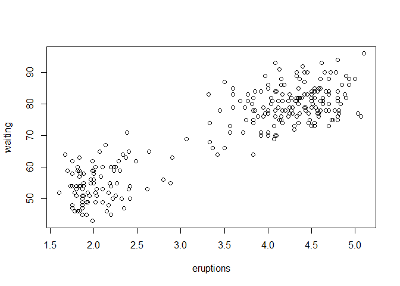

<!-- README.md is generated from README.Rmd. Please edit that file -->

# shinyfaithful

<!-- badges: start -->
<!-- badges: end -->

The goal of shinyfaithful is to …

## Installation

You can install the development version of shinyfaithful like so:

``` r
# FILL THIS IN! HOW CAN PEOPLE INSTALL YOUR DEV PACKAGE?
```

## Example

This is a basic example which shows you how to solve a common problem:

``` r
library(shinyfaithful)
## basic example code
```

What is special about using `README.Rmd` instead of just `README.md`?
You can include R chunks like so:

``` r
summary(faithful)
#>    eruptions        waiting    
#>  Min.   :1.600   Min.   :43.0  
#>  1st Qu.:2.163   1st Qu.:58.0  
#>  Median :4.000   Median :76.0  
#>  Mean   :3.488   Mean   :70.9  
#>  3rd Qu.:4.454   3rd Qu.:82.0  
#>  Max.   :5.100   Max.   :96.0
```

You’ll still need to render `README.Rmd` regularly, to keep `README.md`
up-to-date. `devtools::build_readme()` is handy for this.

You can also embed plots, for example:



In that case, don’t forget to commit and push the resulting figure
files, so they display on GitHub and CRAN.
